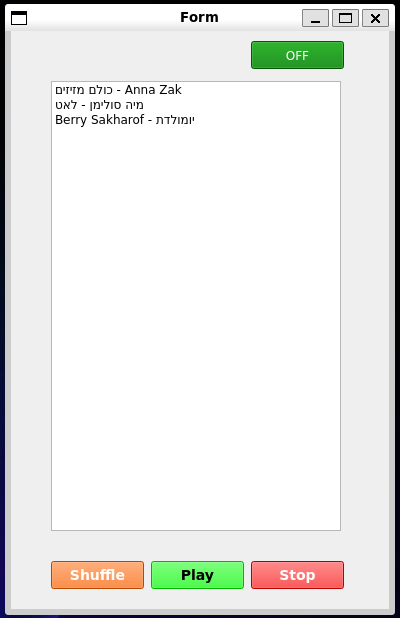

# Инструкции по запуску

```bash
pip install -r requirements.txt
```
Для запуска в WSL (может быть недостаточно, взято [отсюда](https://stackoverflow.com/questions/75462260/problem-running-a-pyqt5-project-in-wslg-no-application-window-shows-up)):
```bash
sudo apt update && sudo apt upgrade -y
sudo apt install python3-venv python3-pyqt5
mkdir -p src/pyton_music_player
cd src/pyton_music_player
python3 -m venv .venv
source .venv/bin/activate
pip install pyqt5
```
